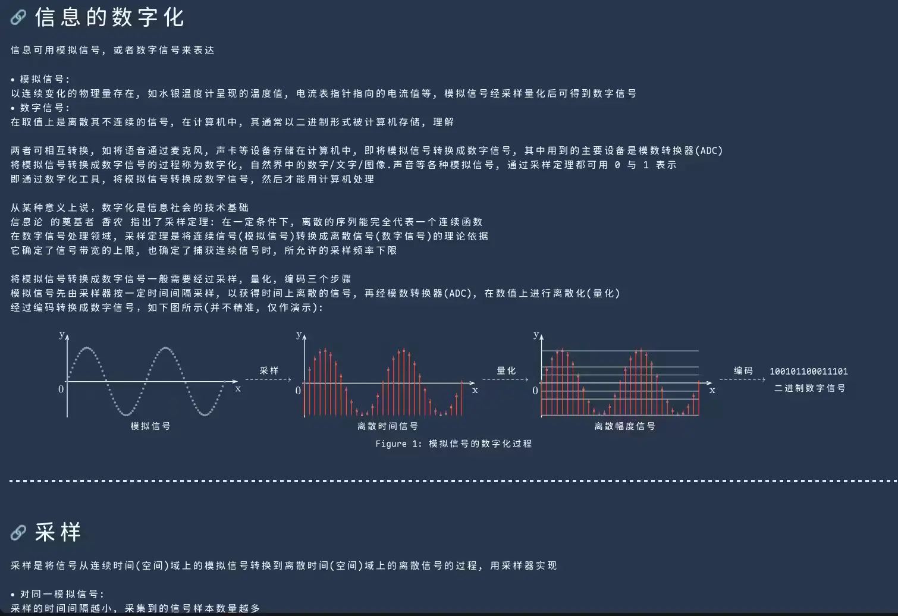
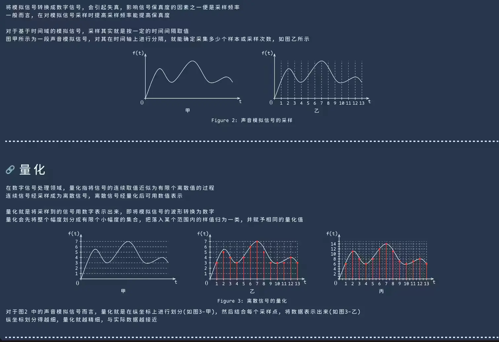
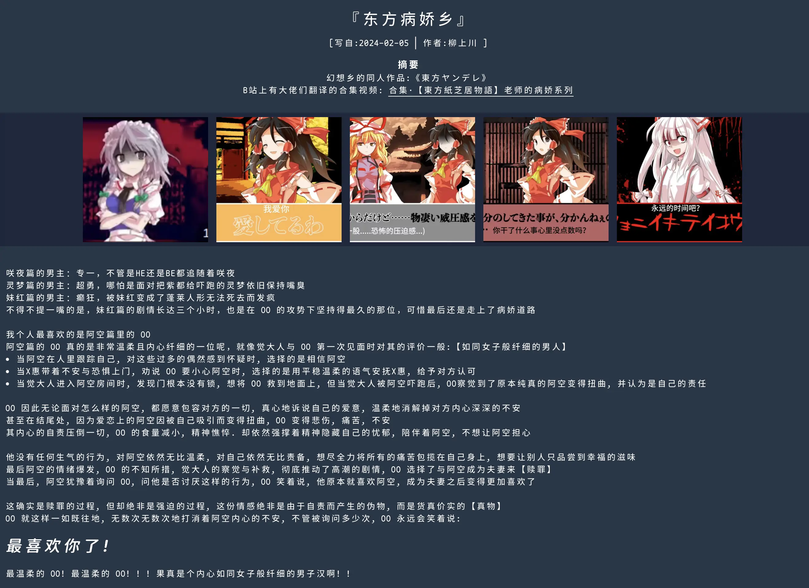
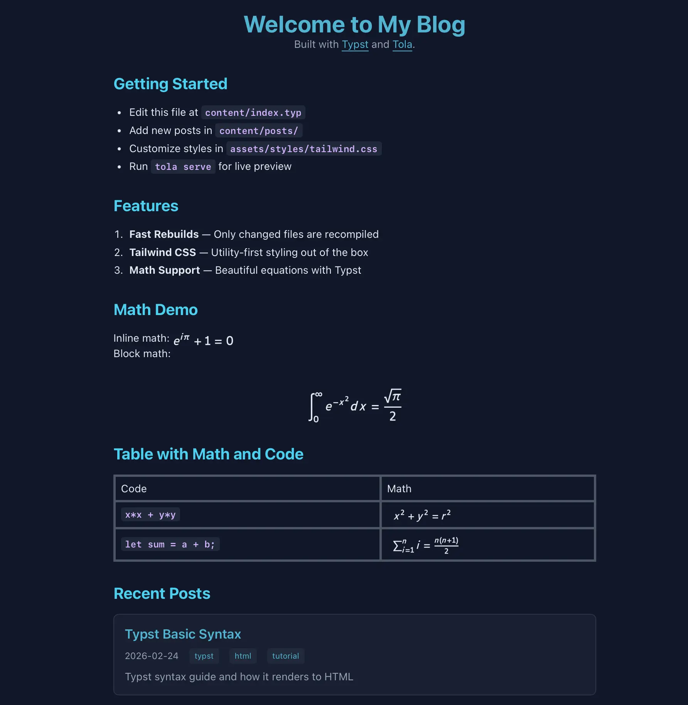
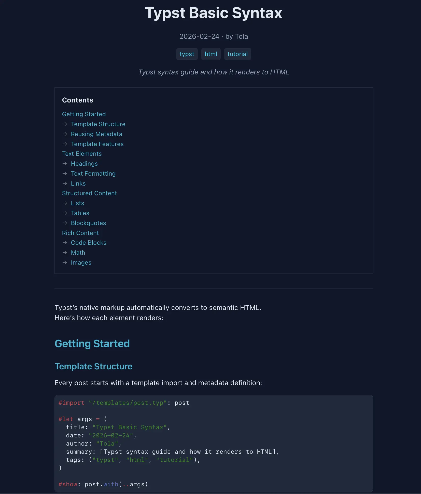

# tola-ssg
[ [English](./README.md) | **中文** ]

基于 Typst Bundle 的静态站点生成器。用 Typst 编写内容、模板和站点程序，从同一个站点生成 HTML 页面、PDF/SVG/PNG 文档及其他文件。

```sh
tola init my-blog
cd my-blog
tola build
tola dev
```

内置指南和可运行示例随安装的程序一起提供：

```sh
tola help -i
tola help package source
tola help package document headings
tola help config build
tola help demo backlinks --preview
tola help demo sources --export ./sources-site
```

导出目录必须尚不存在，父目录必须已存在。加上 `--edit`，使用 `TOLA_EDITOR`、`VISUAL` 或 `EDITOR` 打开导出的源码；`--editor` 可指定本次使用的编辑器。`tola skill` 输出站点编写指南。

## 目录

- [展示](#展示)
- [功能](#功能)
- [使用说明](#使用说明)
- [安装](#安装)
- [社区](#社区)
- [注意事项](#注意事项)
- [致谢](#致谢)

## 展示

> 是的，我的博客也是用 `tola` 搭建的。

| 网站 | 描述 |
|------|-------------|
| [kawayww.com](https://kawayww.com) | 作者的个人博客 |
| [example-sites](https://tola-rs.github.io/example-sites/) | 官方示例集合 |

**我的网站（[kawayww.com](https://kawayww.com)）**

| | |
|:---:|:---:|
|  |  |
|  |  |

**初始模板**（[example-sites/starter](https://tola-rs.github.io/example-sites/starter)）

| | |
|:---:|:---:|
|  |  |

## 功能

- **一个站点程序** — 根 Typst Bundle 生成所有文档和资源。一个源文件可以出现在多个文档中，原生查询可以读取整个 Bundle。
- **原生类型元数据** — 用 `tola-meta(...)` 声明元数据，保留 Typst 内容、日期和函数，通过 `@tola/schema` 验证站点自己的字段。
- **文档导航** — 读取当前文档、标题和引用，生成目录与反向链接。
- **资源与媒体** — 发布声明的文件和目录树、缩放图像、使用图标集合、配置字体。
- **开发反馈** — `tola dev` 监视站点输入并更新浏览器，无法安全局部更新的变化会触发重新导航。
- **站点工具** — 检查和查看源文件、文档、路由、输出及引用，使用内置包指南和编辑器集成。
- **可编辑模板** — 在普通 Typst 代码中生成元数据筛选、自定义路由、订阅源、站点地图、规范链接、Open Graph 和 Twitter Cards。
- **构建集成** — 运行构建前、生成输出和发布后的钩子；创建站点时可选择 Tailwind CSS 或 Pagefind 配置。可选 SPA 导航使用 DOM morphing 和 View Transitions。
- **离线输入** — 用 `tola vendor` 固定构建选中的包、字体和图标数据，再用 `--pure` 验证站点。

## 使用说明

运行 `tola --help` 或 `tola <command> --help` 查看选项。Tola 从当前目录向上搜索 `tola.toml`。

### 源文件与文档

站点从 `build.entry` 开始，通常是 `site.typ`。Tola 发现 `build.content-dir`（通常为 `content/`）下的 `.typ` 源文件，收集它们的元数据声明。根程序决定包含哪些源文件，以及发布哪些输出路径。

```text
.
├── tola.toml
├── site.typ                 # 根 Bundle 程序
├── content/                 # 内容源文件
│   ├── index.typ
│   └── posts/hello.typ
├── site/                    # 可编辑模板、元数据 schema 和筛选规则
│   ├── page.typ
│   ├── schema.typ
│   └── selection.typ
└── static/                  # 站点使用或声明发布的资源
```

在内容源文件中声明元数据：

```typst
#import "@tola/source:0.0.0": tola-meta
#tola-meta((title: [Hello *Typst*], date: datetime(year: 2026, month: 10, day: 8)))

= Hello
这里是源文件的正文。
```

一个简单的 `site.typ` 可以发布发现的源文件：

```typst
#import "@tola/source:0.0.0": all-sources
#import "@tola/address:0.0.0": route, route-to-output

#for source in all-sources() {
  let output = route-to-output(route(source.route-segments))
  document(output, format: "html", title: source.meta.title)[
    #include source.file
  ]
}
```

初始模板在 `site/selection.typ` 中加入元数据验证、草稿筛选和路由 slug 处理。`title`、`draft`、`permalink` 等字段遵循站点可编辑的 schema。源文件是输入，`document(...)` 决定发布什么：同一源文件可以生成多个页面、出现在 PDF 中，也可以不发布。

在根程序中写 `asset("data.json", bytes(json.encode(data)))`，即可生成数据文件。文档输出路径决定路由：`notes/index.html` 对应 `/notes/`；`site.base-path` 为浏览器 URL 加上部署前缀。原生 `query(...)` 仍查询整个 Bundle，`@tola/document` 提供限定在文档内的查询。

### 内置包

| 包 | 用途 |
|----|------|
| `@tola/source:0.0.0` | `all-sources()`、`current-source()`、`tola-meta(...)`、`parse-sources(...)` |
| `@tola/document:0.0.0` | 在 `context` 中调用 `current-document()`、`headings(...)`、`references(...)` |
| `@tola/site:0.0.0` | 解析后的 `site` 配置 |
| `@tola/address:0.0.0` | 路由、输出路径、浏览器 URL、slug 和 `asset-url(...)` |
| `@tola/schema:0.0.0` | 验证并解析元数据值 |
| `@tola/collection:0.0.0` | 按自己的键和层级筛选、分组、索引与导航数组 |
| `@tola/web:0.0.0` | head 元数据、规范链接、社交卡片、订阅源、站点地图和 SVG 公式 |
| `@tola/icon:0.0.0` | 内联图标和发布的图标 URL |
| `@tola/image:0.0.0` | 图像元数据和缩放后的图像输出 |
| `@tola/code:0.0.0` | 代码高亮和样式表 |

`tola help package <name>` 提供当前签名和示例。`tola help demo` 列出源文件、反向链接、标题、媒体、订阅源及多输出的完整站点。

### 配置

```toml
[site]
title = "My Blog"
origin = "https://example.com"
base-path = "/"
language = "en"

[build]
entry = "site.typ"
content-dir = "content"
publish-dir = "public"

[assets]
trees = [{ source = "static/web", url-prefix = "/assets" }]

[typst.fonts]
paths = []
system = false

[vendor]
path = "vendor"
```

声明该资源树前，先创建 `static/web`。禁用系统字体发现后，声明路径中的字体和内置字体仍可使用。`tola init --dry-run` 展示初始模板而不写文件；`tola help config` 说明各配置表。

共享模板与辅助代码可以放在站点内、`content/` 外的任意位置。Tola 观察它们的导入和文件读取。源文件或辅助代码的变化可能通过导入和站点全局查询影响多个文档。

### 构建、检查与开发

```sh
tola build                  # 发布完整站点
tola check                  # 检查但不发布
tola inspect sources        # 以 JSON 查看源文件声明的元数据
tola inspect documents      # 以 JSON 查看构建后的 HTML 文档
tola inspect references     # 以 JSON 查看链接和资源解析
tola dev                    # 编辑时重建并提供站点服务
tola preview                # 构建一次并预览
```

生产构建先检查完整输出，再替换 `public/`。构建失败时，先前发布的站点保持不变。手工维护的文件应放在声明的资源输入中，不要放进发布目录。

持续开发会复用源文件和 Typst 计算缓存；图像衍生文件也可以从磁盘复用。缓存保留完整 Bundle 编译的输出和诊断。

### 离线与 vendor 输入

```sh
tola build --offline
tola vendor --dry-run
tola vendor
tola build --pure
```

`--offline` 禁止 Tola 访问网络，但仍允许配置的主机输入和缓存。`--pure` 还排除主机包目录、系统字体及站点外的文件读取，包括指向站点外的符号链接。

`tola vendor` 固定构建选中的依赖，使用准备好的输入完成 pure 构建验证后，才替换 vendor 树。Vendoring 跳过构建钩子。已有 vendor 包优先于主机包目录；`tola vendor --refresh` 从其他可用目录重新选择。`--dry-run` 执行验证，但不替换 vendor 树。

## 安装

### Cargo

```sh
cargo install --locked tola
```

### 二进制发布版

从 [发布页面](https://github.com/tola-rs/tola-ssg/releases) 下载。

### Nix Flake

Flake 可为 Linux 和 macOS 构建 Tola。将它加入 flake 输入：

```nix
inputs.tola = {
  url = "github:tola-rs/tola-ssg";
  inputs.nixpkgs.follows = "nixpkgs";
};
```

安装 `inputs.tola.packages.${pkgs.system}.default`；Linux 还提供 `.static`。[Cachix 缓存](https://tola.cachix.org) 可复用已有构建：

```nix
nix.settings = {
  substituters = [ "https://tola.cachix.org" ];
  trusted-public-keys = [ "tola.cachix.org-1:5hMwVpNfWcOlq0MyYuU9QOoNr6bRcRzXBMt/Ua2NbgA=" ];
};
environment.systemPackages = [ inputs.tola.packages.${pkgs.system}.default ];
```

需要在 Nix 沙箱中使用 Typst 包时：

```nix
inputs.tola.packages.${pkgs.system}.default.withPackages (ps: [ ps.metalogo ])
```

这会提供 `TYPST_PACKAGE_CACHE_PATH`，作为可离线使用的主机包缓存。Pure 站点构建使用站点内或 vendor 输入。Tola 内嵌 Typst 编译器，无需 Typst CLI。

## 社区

- Matrix: [`#tola:matrix.org`](https://matrix.to/#/#tola:matrix.org)
- QQ: `1065579014`

## 注意事项

> **早期开发阶段 & 实验性 HTML 导出**

`tola` 可用但在不断演进——预期会有破坏性变更和不足之处。欢迎反馈和贡献！

HTML 与分页文档采用不同的输出模型。页面尺寸和定位布局不会自动转成 HTML；浏览器布局使用 HTML 元素和 CSS，需要分页渲染效果时可以嵌入渲染后的 frame。`tola help package web math-svg` 说明 HTML 中的 SVG 公式，`tola help demo multiple-outputs` 展示同一源文件的多种输出。Typst 的 HTML 和 Bundle 目标仍属实验性功能。

## 文档

- 运行 `tola --help` 和 `tola <command> --help` 查看 CLI 用法
- 参考 [tola-rs/example-sites](https://github.com/tola-rs/example-sites) 中的示例和源码
- 如有任何问题，请提交 issue

# 致谢

- [typsite](https://github.com/Glomzzz/typsite): 为 typst 打造的静态网站生成器（SSG）
- [kodama](https://github.com/kokic/kodama): 面向 Typst 的静态 Zettelkästen 站点生成器。
- [tinymist](https://github.com/Myriad-Dreamin/tinymist): `tola-lsp` 的部分实现改编自它（Apache-2.0）

## 许可证

MIT
