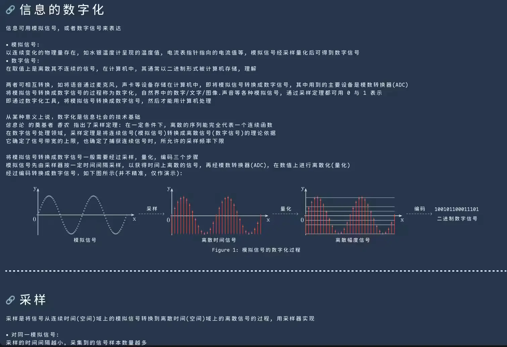
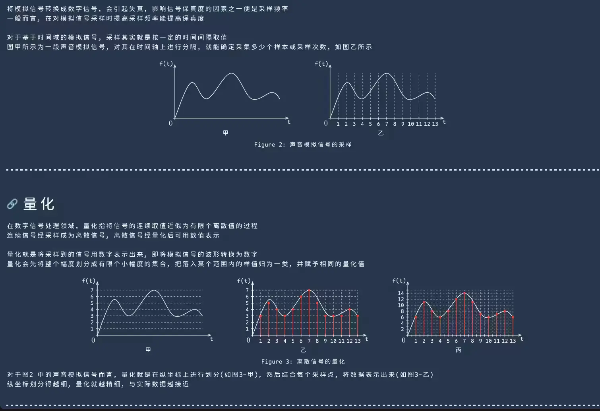
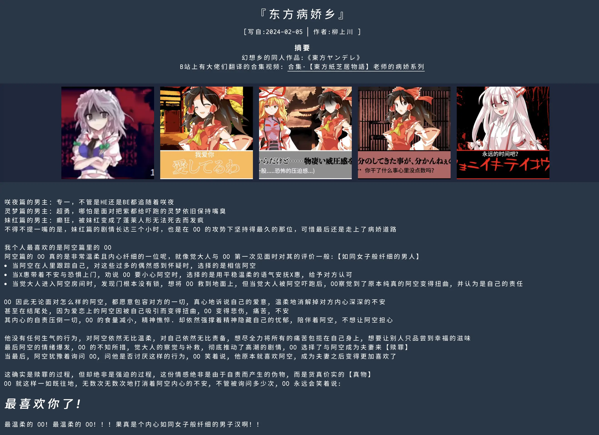
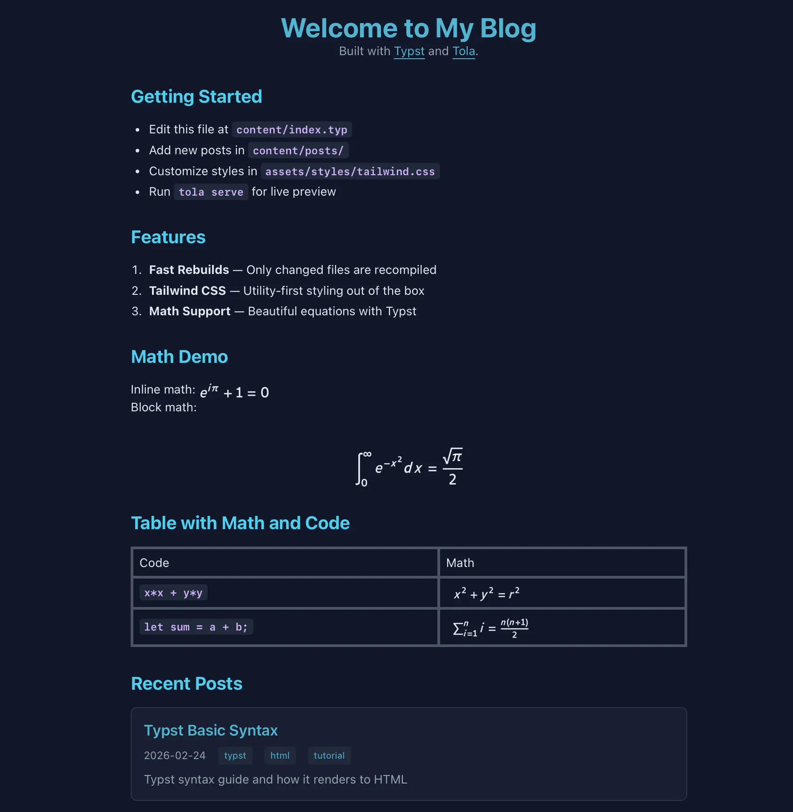
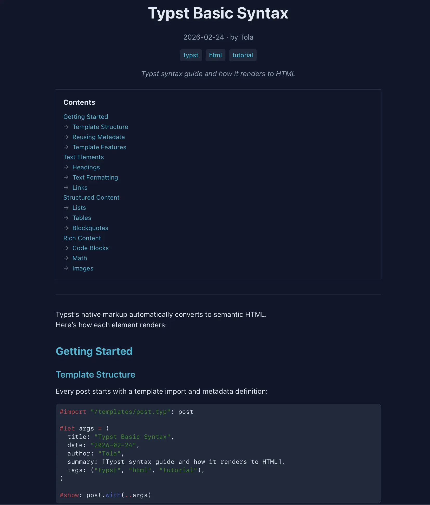

# tola-ssg

A static site generator for Typst-based websites.

> Note (v0.7.x): Released now. Some caching-related bugs may still exist. You can use `tola s -c`(`serve --clean`) as a workaround, but please try regular `serve` first so I can collect feedback and fix these issues in upcoming updates. Thanks for your support!


## Table of Contents

- [Showcase](#showcase)
- [Features](#features)
- [Philosophy](#philosophy)
- [Usage](#usage)
- [Installation](#installation)
- [Community](#community)
- [Note](#note)
- [Acknowledgements](#acknowledgements)

## Showcase

> Yeah, my blog is also built with `tola`.

| Site | Description |
|------|-------------|
| [kawayww.com](https://kawayww.com) | Author's personal blog |
| [example-sites](https://tola-rs.github.io/example-sites/) | Official example collection |

**My site ([kawayww.com](https://kawayww.com))**

| | |
|:---:|:---:|
|  |  |
|  |  |

**Starter Template** ([example-sites/starter](https://tola-rs.github.io/example-sites/starter))

| | |
|:---:|:---:|
|  |  |

<details>
<summary>How to make "Recent 5 Posts" with Tola's virtual package system</summary>

Thanks to `typst` and `tailwindcss`, `tola` offers writing flexibility.
Implement `Recent Posts` easily with the `@tola/pages` virtual package.
This snippet is aligned with the starter virtual package article source:
`https://github.com/tola-rs/example-sites/blob/main/starter/content/posts/virtual-packages.typ`.

```typst
#import "@tola/pages:0.0.0": pages
#import "/components/ui.typ" as ui

#let posts = (pages()
  .filter(p => "/posts/" in p.permalink)
  .filter(p => p.at("date", default: none) != none)
  .sorted(key: p => p.date)
  .rev())

#html.div(class: "space-y-6")[
  #for post in posts.slice(0, calc.min(posts.len(), 5)) {
    ui.post-card(post)
  }
]
```

The `@tola/pages` package provides access to all page metadata (title, date, permalink, tags, etc.) at compile time.

</details>

## Features

### Performance

- **parallel compilation** — Process pages concurrently
- **font preloading** — Fonts loaded once at startup, shared across all compilations
- **snapshot sharing** — Typst compiler snapshot reused across batch compilations, avoiding repeated initialization

### Development Experience

- **zero config to start** — `tola init <SITE-NAME>` gets you running in seconds
- **local server** — Built-in HTTP server with on-demand compilation
- **hot reloading** — File changes are diff/patched to the browser instantly via WebSocket
- **priority queue scheduler** — Prioritizes currently viewed pages for faster feedback
- **incremental rebuilds** — Bidirectional dependency graph + VDOM caching enables minimal rebuilds; only affected pages are recompiled
- **graceful error handling** — Human-readable diagnostic messages from Typst
- **escape hatches** — Full access to HTML/CSS/JS when you need it

### Build & Integration

- **build hooks** — Pre/post build hooks for custom scripts (e.g., esbuild, imagemin)
- **Tailwind CSS** — Built-in CSS processor integration
- **html/xml minification** — Optional minification for production builds
- **SPA navigation** — Optional client-side navigation with DOM morphing and View Transitions API (limitation: inline scripts should be idempotent; navigation may execute them more than once)

### Routing & SEO

- **clean and simple URLs** — `content/posts/hello.typ` → `/posts/hello/`
- **custom permalinks** — Override URL via page metadata
- **aliases** — Redirect old URLs to new locations
- **url slugification** — Configurable slug modes (full, safe, ascii) with case options
- **url conflict detection** — Errors when multiple pages resolve to the same URL
- **rss/atom support** — Auto-generate `feed.xml` from page metadata
- **sitemap** — Auto-generate `sitemap.xml` for search engines
- **Open Graph & Twitter Cards** — Auto-inject default OG tags from site config, or customize per-page via `og-tags()` in Typst
- **404 typst/html page** — Configurable not-found page(.typ or .md)

### Virtual Packages

Tola injects virtual packages at compile time, enabling cross-page data access without external build steps:

- `@tola/site:0.0.0` — Site metadata and root path
- `@tola/pages:0.0.0` — All pages metadata (title, date, permalink, tags, draft status...)
- `@tola/current:0.0.0` — Current page context (`current-permalink`, `path`, `headings`, navigation helpers...)

```typst
#import "@tola/pages:0.0.0": pages
#import "@tola/site:0.0.0": info, root

// List all posts
#for post in pages().filter(p => "/posts/" in p.permalink) {
  [#post.title (#post.date)]
}

// Access site title
#info.title
```

Canonical examples are maintained in the starter article:
`https://github.com/tola-rs/example-sites/blob/main/starter/content/posts/virtual-packages.typ`

See [Virtual Packages in Usage](#virtual-packages-1) for more details.

## Philosophy

> **Keep your focus on the content itself.**

### Typst First

If Typst can easily do it, use Typst. No need to explain Typst's strengths here — even with HTML export losing many layout features, it's still remarkably powerful.

`tola` leverages Typst's markup and scripting capabilities instead of reinventing the wheel.

### Tola Second

Some things are beyond what a standalone `typst` CLI can do — especially batch processing and site-wide coordination:

- Automatic routing from file structure
- Seamless hot reload with VDOM diff/patch
- SVG dark mode adaptation out of the box
- Cross-page state via `sys.inputs` and virtual packages injection
- ...And more!

That's where `tola` steps in — optimizing developer experience and integrating these features seamlessly is no small feat.


## Usage

- [Example Site Structure](#example-site-structure)
- [Shared Dependencies](#shared-dependencies)
- [Configuration](#configuration)
- [Virtual Packages](#virtual-packages-1)
- [Open Graph & Twitter Cards](#open-graph--twitter-cards)
- [Quick Start](#quick-start)

Run `tola --help` or `tola <command> --help` for detailed CLI usage.

You can run `tola` from any subdirectory — it will automatically find `tola.toml` by searching upward.

### Example Site Structure

```text
.
├── tola.toml                 # Site configuration
├── content/                  # Page sources (routes)
│   ├── index.typ             #   -> /
│   ├── about.typ             #   -> /about/
│   ├── posts/
│   │   └── hello.typ         #   -> /posts/hello/
│   └── error.typ             # Custom 404 page
├── templates/                # Shared layouts (default in `build.deps`)
│   ├── tola.typ              #   Default template from `tola init` (fully customizable)
│   ├── post.typ              #   Post layout (can extend tola.typ)
│   └── normal.typ            #   Normal page layout
├── utils/                    # Helper functions (default in `build.deps`)
│   └── tola.typ              #   Utility functions from `tola init` (CSS class, OG tags, etc.)
├── components/               # Custom components (add to `build.deps` manually)
│   ├── layout.typ            #   Reusable layout components
│   └── ui.typ                #   UI components (post-card, tag-list, etc.)
└── assets/
    ├── images/
    ├── fonts/
    │   └── Luciole-math.otf  # Embedded math font (auto-loaded by tola)
    ├── styles/
    │   └── tailwind.css      # Tailwind input (if using `build.hooks.css`)
    └── scripts/
```

### Shared Dependencies

The routing under `content/` is probably intuitive — files map to URLs. But you might wonder about `build.deps` in `tola.toml`. You can actually use it without thinking too hard, but a quick explanation might help:

Typst files in `content/` become pages. But they often `#import` shared code from `templates/`, `utils/`, or something else you prefer — these are just conventional names tola provides by default, feel free to rename them. Tola tracks these dependencies internally. When you declare directories in `build.deps`, tola knows: "if anything here changes, recompile all pages that import from it." This enables instant hot-reload across your entire site.

`templates/` and `utils/` are just default names — you can rename them or add more via `build.deps`. For example: you have `templates/base.typ` that styles math equations with Tailwind classes. When you change `text-base` to `text-2xl` in that file, any page importing it (like `content/example.typ` -> `/example/`) will instantly reflect the larger equations — no manual refresh needed.

### Configuration

Common `tola.toml` settings (run `tola init --dry` to see full defaults):

```toml
# Access in Typst: #import "@tola/site:0.0.0": info
# Then use: info.title, info.author, info.extra.custom
[site.info]
title = "My Blog"
author = "Your Name"
email = "you@example.com"
description = "A blog built with Typst and Tola"
language = "en"
url = "https://example.com"

[site.info.extra]
custom = "This is my custom data"

[site.header]
icon = "assets/images/favicon.ico"
styles = ["assets/styles/custom.css"]
scripts = [
  "assets/scripts/custom.js" # Simple: No defer and async
  { path = "assets/scripts/app.js", defer = true }
  { path = "assets/scripts/app.js", async = true }
]
elements = ['<meta name="darkreader-lock">'] # Extra special html elements

[site.seo]
auto_og = true   # Auto-inject default OG tags (site_name, locale, description, type, twitter:card)

[site.seo.feed]
enable = true
format = "rss"   # "rss" | "atom"

[site.seo.sitemap]
enable = true

[build]
content = "content"
output = "public"
minify = true
deps = ["templates", "utils"]  # Shared dependencies — changes trigger range rebuild

[build.assets]
nested = ["assets/images", "assets/styles", "assets/fonts"]

[build.hooks.css]
enable = true
path = "assets/styles/tailwind.css"
command = ["tailwindcss"]
```

### Virtual Packages

Tola provides virtual packages that you can import directly in your Typst files.

Important: use the starter article as the source of truth for API names and examples.
Do not maintain separate hand-written variants in multiple places.

- Display (rendered output):
  [`tola-rs.github.io/example-sites/starter/posts/virtual-packages/`](https://tola-rs.github.io/example-sites/starter/posts/virtual-packages/)
- Source file:
  [`tola-rs/example-sites/starter/content/posts/virtual-packages.typ`](https://github.com/tola-rs/example-sites/blob/main/starter/content/posts/virtual-packages.typ)
- Starter repository:
  [`github.com/tola-rs/example-sites/tree/main/starter`](https://github.com/tola-rs/example-sites/tree/main/starter)

| Package | Exports |
|---------|---------|
| `@tola/site:0.0.0` | `info` — Site metadata (title, author, email, description, url, language, copyright, extra); `root` — Site root path |
| `@tola/pages:0.0.0` | `pages()`, `by-tag(tag)`, `by-tags(..tags)`, `all-tags()` |
| `@tola/current:0.0.0` | `current-permalink`, `parent-permalink`, `path`, `filename`, `links-to`, `linked-by`, `headings`, `siblings(pages)`, `children(pages)`, `breadcrumbs(pages, include-root: false)`, `at-offset(sorted-pages, offset)`, `prev(sorted-pages, n: 1)`, `next(sorted-pages, n: 1)`, `take-prev(sorted-pages, n: 1)`, `take-next(sorted-pages, n: 1)` |

```typst
// content/index.typ — list recent posts
#import "@tola/pages:0.0.0": pages

#let posts = (pages()
  .filter(p => "/posts/" in p.permalink)
  .filter(p => p.at("date", default: none) != none)
  .sorted(key: p => p.date)
  .rev())

#let recent = posts.slice(0, calc.min(posts.len(), 5))

#for post in recent {
  [- #link(post.permalink)[#post.title]]
}
```

<details>
<summary>Example: Recent Posts</summary>

```typst
#import "@tola/pages:0.0.0": pages

#let posts = (pages()
  .filter(p => "/posts/" in p.permalink)
  .filter(p => p.at("date", default: none) != none)
  .sorted(key: p => p.date)
  .rev())

#let recent = posts.slice(0, calc.min(5, posts.len()))

#for post in recent {
  [- #link(post.permalink)[#post.title]]
}
```

</details>

<details>
<summary>Example: Filename-Derived Metadata</summary>

Use `path` and `filename` from `@tola/current` to parse date from filename like `2025_02_27_hello.typ`:

```typst
#import "@tola/current:0.0.0": path, filename

#let file = filename.replace(".typ", "").replace(".md", "")
#let parts = file.split("_")
#let auto-date = if parts.len() >= 4 {
  parts.slice(0, 3).join("-")
} else {
  none
}
```

</details>

<details>
<summary>Example: Hierarchy + Navigation Helpers</summary>

```typst
#import "@tola/pages:0.0.0": pages
#import "@tola/current:0.0.0": prev, next, breadcrumbs, children, siblings

#let all = pages()
#let sorted-posts = (all
  .filter(p => "/posts/" in p.permalink and p.date != none)
  .sorted(key: p => p.date))

#let prev-post = prev(sorted-posts)
#let next-post = next(sorted-posts)
#let crumbs = breadcrumbs(all, include-root: true)
#let direct-children = children(all)
#let same-level = siblings(all)
```

</details>

<details>
<summary>Example: Offset Navigation Window</summary>

```typst
#import "@tola/pages:0.0.0": pages
#import "@tola/current:0.0.0": at-offset, take-prev, take-next

#let dated = (pages()
  .filter(p => "/posts/" in p.permalink and p.date != none)
  .sorted(key: p => p.date))

#let two-back = at-offset(dated, -2)
#let two-forward = at-offset(dated, 2)
#let previous = take-prev(dated, n: 2)
#let next = take-next(dated, n: 2)
```

</details>

### Open Graph & Twitter Cards

Tola auto-injects default OG tags from `[site.info]` when `site.seo.auto_og = true`. For page-specific customization, use the `og-tags()` function in your template's `head` parameter:

```typst
#import "/templates/tola.typ": tola-page
#import "/utils/tola.typ": og-tags, parse-date

#let head = og-tags(
  title: "My Post",
  description: "A great article about...",
  url: "https://example.com/posts/my-post/",
  image: "https://example.com/og-image.png",
  type: "article",                      // "website" | "article" | "book" | "profile"
  published: parse-date("2024-01-15"),  // article:published_time
  tags: ("rust", "typst"),              // article:tag
)

// In your template
tola-page(
  title: "My Post",
  head: head,
)[...]
```

When you use `og-tags()`, Tola skips auto-injection and uses your custom tags instead.

### Quick Start

```sh
# Create a new site
tola init my-blog
cd my-blog

# Edit `content/index.typ`

# Build for production
tola build

# Start development server
tola serve
```

## Installation

### Cargo

```sh
cargo install --locked tola
```

### Binary Release

Download from the [release page](https://github.com/tola-rs/tola-ssg/releases).

### Nix Flake

A `flake.nix` is provided in the repo. Pre-built binaries are available at [tola.cachix.org](https://tola.cachix.org).

**Step 1**: Add tola as an input in your `flake.nix`:

```nix
{
  inputs.tola = {
    url = "github:tola-ssg/tola-ssg/v0.7.1";
    inputs.nixpkgs.follows = "<your nixpkgs input here>";
    inputs.rust-overlay.follows = "<your rust-overlay input here, if you have one>";
    # ...
  };
}
```

**Step 2**: Configure cachix in your `configuration.nix`:

```nix
{ config, pkgs, inputs, ... }:

{
  nix.settings = {
    substituters = [ "https://tola.cachix.org" ];
    trusted-public-keys = [ "tola.cachix.org-1:5hMwVpNfWcOlq0MyYuU9QOoNr6bRcRzXBMt/Ua2NbgA=" ];
  };

  environment.systemPackages = [
    # 1. Native build (recommended if you want to build from source)
    # inputs.tola.packages.${pkgs.system}.default

    # 2. Pre-built binaries (recommended for fast CI/CD)
    # Choose the one matching your system:
    inputs.tola.packages.${pkgs.system}.aarch64-darwin        # macOS (Apple Silicon)
    # inputs.tola.packages.${pkgs.system}.x86_64-linux        # Linux (x86_64)
    # inputs.tola.packages.${pkgs.system}.aarch64-linux       # Linux (ARM64)
    # inputs.tola.packages.${pkgs.system}.x86_64-windows      # Windows (x86_64)

    # 3. Static Binaries (Linux only)
    # inputs.tola.packages.${pkgs.system}.x86_64-linux-static
    # inputs.tola.packages.${pkgs.system}.aarch64-linux-static
  ];
}
```

If you need extra typst packages inside a nix sandbox(internet is not available):

```nix
inputs.tola.packages.${pkgs.system}.default.withPackages (ps: [ ps.metalogo ])
```

It sets `TYPST_PACKAGE_CACHE_PATH` for `tola`, so users can use packages via `@preview/...`.
(`tola` itself does not depend on the typst CLI at all)

## Community

- Matrix: [`#tola:matrix.org`](https://matrix.to/#/#tola:matrix.org)
- QQ: `1065579014`

## Note

> **Early development & experimental HTML export**

`tola` is usable but evolving — expect breaking changes and rough edges. Feedback and contributions are welcome!

Typst's HTML output is not yet as mature as its PDF output. Some features require workarounds:

- **math rendering** — Equations are exported as inline SVGs, which may need CSS tweaks for proper sizing and alignment ([issue #24](https://github.com/tola-rs/tola-ssg/issues/24))
- **whitespace handling** — Typst inserts `<span style="white-space: pre-wrap">` between inline elements to preserve spacing ([PR #6750](https://github.com/typst/typst/pull/6750))
- **layout** — Some Typst layout primitives don't translate perfectly to HTML semantics

These are upstream limitations in Typst itself, not `tola`. As Typst's HTML backend matures, these rough edges will smooth out.

## Documentation

- Run `tola --help` and `tola <command> --help` for CLI usage
- See [tola-rs/example-sites](https://github.com/tola-rs/example-sites) for examples and source code
- Open an issue if you have any question

More formal documentation to follow.

# Acknowledgements

- [typsite](https://github.com/Glomzzz/typsite): Static site generator(SSG) for typst
- [kodama](https://github.com/kokic/kodama): A Typst-friendly static Zettelkästen site generator.

## License

MIT
